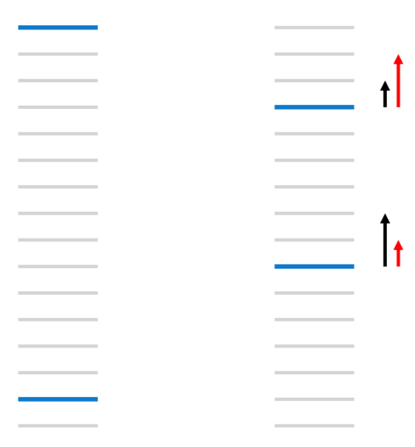

L2R(learning to rank)是指利用机器学习的技术，去完成排序的任务。在模型训练阶段，该算法最终优化的目标是一个更加合理的排序指标。L2R技术已经成功应用在信息检索(IR)、NLP、和数据挖掘(DM)等领域【1】。根据具体优化的目标不同，L2R算法主要分为Pointwise，Pairwise，Listwise三类。本文首先介绍L2R建模的整体框架，然后针对三类方法分别进行介绍。

# L2R建模

L2R建模的基本框架如下所示：

 

图1：L2R基本框架

如图1所示，模型具体分为训练和预测两个解读。

**训练阶段：** 训练数据包括多个group, 其中每个group由1个query和1组document共同构成。该group中，$q\_i$表示第$i$个query，$d\_{i,j}$表示对应第$i$个query的第$j$个document, 不仅包含了document的各种属性，也包括了对应document和query之间的相关性标签$y\_i$。具体如下所示：

$S=[((q\_1, D\_1), y\_1), ((q\_2, D\_2), y\_2), ..., ((q\_m, D\_m), y\_m)]$
 
$D\_i=[d\_{i,1}, d\_{i,2}, ..., d\_{i,n}]$

$y\_i=[y\_{i,1}, y\_{i,2}, ..., y\_{i,n}]$

其中$m$表示query个数，$n$表示每个group的document个数（此处假设每个group的document个数相同为$n$）

在训练阶段，每个pair$(q\_i$, $d\_{i,j})$ 都提取相关的特征，作为特征向量$x\_{i,j}$。 模型学习的目标是，对每个pair$(q\_i$, $d\_{i,j})$，预测其对应的分数$f(x\_{i,j})$, 使得根据这些分数得到的每个$q\_i$对应的所有$d\_{i,j}$排序尽量接近真实排序。

**预测阶段：** 输入query $q\_{m+1}$和document集合$D=[d\_1, d\_2, ... , d\_N]$, 利用训练得到的model，预测query $q\_{m+1}$和每个document $d\_i$的相关性分数，并根据预测的分数对document进行排序，输出排序列表。

**和分类回归的关系：** 传统的分类和回归方法，通过学习相关模型，预测样本的类别或者分数值；而排序模型，则是通过模型，预测样本相关性(或者其它分数)的相对顺序。在分类问题中，有一种问题是序数分类(Ordinal Classification)，序数分类问题和排序问题有点类似，不同之处在于序数分类的目标是预测顺序的类别(ordered-categorization of objects)，而排序问题的目标是预测相对顺序(ordering)。

# L2R评估

L2R的评估基于预测的rank list和真实的rank list比较，主要有DCG(Discounted Cumulative Gain)，NDCG(Normalized Discounted Cumulative Gain)，MAP(Mean Average Precision)等评估指标。

## DCG

对于给定的query, TOP T的返回结果对应的DCG值如下所示：

$DCG@T = \sum\_{i=1}^T \frac{2^{l\_i} - 1}{log(1 + i)} $

其中$i$表示预测结果列表中第$i$个位置，$l\_i$表示预测结果中第$i$个位置的document的真实相关性值。分子部分描述了饭回结果的相关性，分母部分针对位置进行加权，排序越靠前，其对应的相关性值权重系数越大。

所有query的平均DCG值作为最终排序系统DCG评估值。

## NDCG

NDCG在DCG指标基础上进行了扩展，通过将DCG值除于DCG最佳排序对应的DCG值，将其归一化到0-1的范围，其定义如下所示：

$NDCG@T = \frac{DCG@T}{maxDCG@T} $

所有query的平均NDCG值作为最终排序系统DCG评估值。

## MAP

map是L2R中另一种评估指标，其对应的相关性标签只有0和1。对于给定的query，AP的定义如下所示：
$AP = \frac{\sum\_{i=1}^{n} P(i) * l\_i}{\sum\_{i=1}^{n}l\_i}$

其中$i$表示预测结果列表中第$i$个位置，$l\_i$表示预测结果中第$i$个位置的document的真实相关性值（在MAP中，相关性值取0或1）。$n$表示排序列表的长度，$P(i)$表示从列表第一个位置到第$i$个位置预测结果的平均准确率，其定义如下：
 $P(i) = \frac{\sum\_{k=1}^i l\_k}{i}$

所有query的平均AP值作为最终排序系统MAP评估值。

# Pointwise

在Pointwise方法中，排序问题可以转化成分类或回归问题，分类(包括序数分类)或回归的方法都可以使用。由于建模没有使用样本的相对顺序，group也不需要构建。

此处以OC SVM(SVM for Ordinal Classification)【2】为例，说明如何利用分类方法解决排序问题。该方法优化的目标是，对于任何相邻的2个类别，最大化其对应的分类间隔。实现层面，如图2所示，对于类别为$l$的序数分类问题，引用$l-1$个分类器 $⟨w, x⟩−b\_r(r = 1,···,l − 1)$, 其中$ b\_1≤···≤b\_{l−1}≤b\_l=\inf $。$⟨w, x⟩−b\_r = 0$用于划分第$r$和$r-1$个类别，如果$⟨w, x⟩ + b\_{r-1} >= 0$并且$⟨w, x⟩ + b\_{r} < 0$, 则样本标签属于$y=r$。建模的目标函数如下所示：

$min\_{w, b, \xi} = \frac{1}{2}||w||^2+C\sum\_{r=1}^{l-1}\sum\_{i=1}^{m\_r}(\xi\_{r,i}+\xi\_{r+1,i}^*)$ 

约束如下：

$⟨w, x\_{r, i}⟩ + b\_r < -(1 - \xi\_{r,i})$

$⟨w, x\_{r+1, i}⟩ + b\_r >= 1 - \xi\_{r, i}^*$

$\xi\_{r,i} >= 0$

$\xi\_{r+1,i}^* >= 0$

$i = 1, 2, ... , m\_r$

$r = 1, 2, ..., l-1$

$m = m\_1 + m\_2 + ... + m\_l$

其中 $x\_{r,i}$表示第$r$个类别的第$i$个样本，$\xi\_{r,i}$和$\xi\_{r+1,i}^*$表示对应的松弛变量，$m$是样本的个数, $m\_i$表示第$i$类样本的个数。

 

图2：SVM for Ordinal Classification【2】

# Pairwise

基于pairwise的rank方法中，将排序问题转化为pairwise的分类或回归问题进行求解。通常情况下，针对一个query对应的document pair, 利用分类器对pair的order进行判断。常见的pairwise rank方法有RankNet、RankSvm等，此处以RankNet为例进行说明。

## RankNet原理及求解
**RankNet建模**

RankNet使用的打分模型要求对参数可导，训练数据根据query分为多个组，对于1个给定的query，选择2个不同相关性label的document pair，计算相关性分数$s\_i=f(x\_i)$和$s\_j=f(x\_j)$，RankNet对其对应的特征向量进行打分。$d\_i>d\_j$表示document $d\_i$的相关性大于$d\_j$。

document $d\_i$的相关性大于document $d\_j$的概率如下:

$P\_{ij}=P(d\_i>d\_j)=\frac{1}{1+e^{-\sigma (s\_i-s\_j)}}  (1)$ 

其中$\sigma$是常数，决定sigmoid函数的形状。RankNet采用交叉熵函数训练模型，如下所示。其中$P'\_{ij}$表示真实的$d\_i$相关性大于$d\_j$的概率。

$C=-P'\_{ij}logP\_{ij}-(1-P'\_{ij})log(1-P\_{ij})  (2)$

**RankNet求解**

为方便后续描述，针对1个给定的query，我们定义变量$S\_{ij}$：

$S\_{ij} =
\begin{cases}
1,  & d\_i比d\_j更相关\\\\
-1,  & d\_j比d\_i更相关\\\\
0  & d\_i和d\_j相关性相同
\end{cases}
 (3)$

在本文中，假定对于每个query，其对应所有document的相关性顺序都是完全确定的。

因此，

$P'\_{ij}=\frac{1}{2}(1+S\_{ij}). (4)$

由上述式2和式4可以得出：

$C=-P'\_{ij}logP\_{ij}-(1-P'\_{ij})log(1-P\_{ij}) \\\\
  = -\frac{1}{2}(1+S\_{ij})logP\_{ij}-(1-\frac{1}{2}(1+S\_{ij}))log(1-P\_{ij}) \\\\
  = -\frac{1}{2}(logP\_{ij}+log(1-P\_{ij}))-\frac{1}{2}S\_{ij}(logP\_{ij}-log(1-P\_{ij}) \\\\
  = -\frac{1}{2}log(P\_{ij}*(1-P\_{ij}))-\frac{1}{2}S\_{ij}log\frac{P\_{ij}}{1-P\_{ij}} \\\\ 
  = -\frac{1}{2}log\frac{e^{-\sigma(s\_i-s\_j)}}{(1+e^{-\sigma(s\_i-s\_j)})^2} -\frac{1}{2}S\_{ij}loge^{\sigma(s\_i-s\_j)} \\\\
  = -\frac{1}{2}(-\sigma(s\_i-s\_j)-2log(1+e^{-\sigma(s\_i-s\_j)})) -\frac{1}{2}S\_{ij}\sigma(s\_i-s\_j) \\\\
  = \frac{1}{2}(1-S\_{ij})\sigma(s\_i-s\_j)+log(1+e^{-\sigma(s\_i-s\_j})
(5)$

$C =
\begin{cases}
log(1+e^{-\sigma(s\_i-s\_j)}),  & 当S\_{ij}=1\\\\
log(1+e^{-\sigma(s\_j-s\_i)}),  & 当S\_{ij}=-1
\end{cases}
(6)$

$C$对$s$求导，结果如下：
$ \frac{\varphi C}{\varphi s\_i}=\sigma (\frac{1}{2}(1-S\_{ij})-\frac{1}{1+e^{-\sigma(s\_i-s\_j)}})=-\frac{\varphi C}{\varphi s\_j} (7)$

通过SGD的方式进行求解

$w\_k=w\_k-\eta (\frac{\varphi C}{\varphi s\_i}\frac{\varphi s\_i}{\varphi w\_k}+\frac{\varphi C}{\varphi s\_j}\frac{\varphi s\_j}{\varphi w\_k}) (8)$

其中$\eta > 0$为学习率。

**RankNet求解加速**

对于给定的文档对$d\_i$和$d\_j$，

$ \frac{\varphi C}{\varphi w\_k}=\frac{\varphi C}{\varphi s\_i}\frac{\varphi s\_i}{w\_k}+\frac{\varphi C}{\varphi s\_j}\frac{\varphi s\_j}{\varphi w\_k} = \sigma (\frac{1}{2}(1-S\_{ij})-\frac{1}{1+e^{-\sigma(s\_i-s\_j)}}) (\frac{\varphi s\_i}{\varphi w\_k} - \frac{\varphi s\_j}{\varphi w\_k})=\lambda\_{ij}(\frac{\varphi s\_i}{\varphi w\_k} - \frac{\varphi s\_j}{\varphi w\_k})(9)$

其中$\lambda\_{ij}=\frac{\varphi C}{\varphi s\_i}= \sigma (\frac{1}{2}(1-S\_{ij})-\frac{1}{1+e^{-\sigma(s\_i-s\_j)}})（10）$

我们定义$I$为索引对$(i,j)$的集合(其中$doc\_i$的相关性大于$doc\_j$)，汇总来自所有文档对的贡献，

$\delta w\_k=-\eta \sum\_{(i,j) \in I} \lambda\_{ij}(\frac{\varphi s\_i}{\varphi w\_k} - \frac{\varphi s\_j}{\varphi w\_k})=-\eta\sum\_i\lambda\_i\frac{\varphi s\_i}{\varphi w\_k}(11)$

其中$\lambda\_i = \sum\_{j:(i,j) \in I}\lambda\_{ij}-\sum\_{j:(j,i) \in I}\lambda\_{ij}$，每个document对应一个$\lambda\_i$，其含义为损失函数对文档$d\_i$的模型打分$s\_i$的梯度。方向表示梯度的方向，大小表示梯度的幅度。每个$\lambda\_i$的计算都来自该document对应的所有pair。在实际计算时，可以对每个文档计算其对应的$\lambda\_i$，然后用于更新模型参数。这种mini-batch的梯度更新方式和问题分解方法，显著提升了RankNet模型训练的效率。

# Listwise

基于pairwise的方法(如RankNet)优化的是pairwise误差，而在很多rank相关领域如信息检索，更加关注的是topK的排序结果。

如下图所示，假定当前文档的相关性值只有0和1，灰色线表示和当前query不相关的文档，蓝色线表示和当前query相关文档，对于左图，pairwise误差为13，对于右图，将上面的相关文档下移3个位置，下面的相关文档上移5个位置，pairwise误差减少到11，而对于NDCG等更加关注top k结果的排序指标，误差可能是增加的。右图中的黑色箭头表示RankNet梯度方向，而我们更想要的是红色箭头对应的梯度方向。此时，就需要利用ListRank方法解决。

 

图3：pairwise和listwise误差比较[3]

我们以LambdaRank方法为例，对Listwise进行说明。

## LambdaRank

LambdaRank的建模和求解与RankNet类似。通过直接写出Cost对模型打分的梯度，而不是直接通过计算得到，是LambdaRank的主要思路。采用这样的思路，能绕过NDCG等排序指标对模型打分求导的困难。而$lambad$值正是代表对模型打分的梯度信息，每篇文档的$lambad$都从其它所有不同label的文档处获得其对应的更新方向和更新值。

对式10进行更新，乘于交换文档对$d\_i$和$d\_j$在rank列表中的位置后NDCG的变化幅度，能得到不错的结果[3]。

$\lambda\_{ij}=\frac{\varphi C}{\varphi s\_i}= \sigma (\frac{1}{2}(1-S\_{ij})-\frac{1}{1+e^{-\sigma(s\_i-s\_j)}})|\triangle NDCG|$

由于每个query对应的文档对集合I中，前一个文档的相关性大于后一个，$S\_{ij}=1$，因此，上式可以直接写成：
$\lambda\_{ij}=\frac{\varphi C}{\varphi s\_i}= \frac{-\sigma |\triangle NDCG|}{1+e^{-\sigma(s\_i-s\_j)}}) (12)$

经验表明，式12能直接优化NDCG指标。实际上，如果我们要优化其它指标，如MAP、MRR等，只需要更新NDCG的变化幅度为其它指标的变化幅度[3]。

## LambdaMART
LambdaMART算法是LambdaRank和MART算法的组合。MART算法提供了算法的框架，需要用到的梯度相关信息则来自LambdaRank方法的梯度$y\_i'=\lambda\_i = \sum\_{j:(i,j) \in I}\lambda\_{ij}-\sum\_{j:(j,i) \in I}\lambda\_{ij}$

为方便描述，我们引入
$\sum\_{(i,j) \doteq I} \lambda\_{ij} = \sum\_{j:(i,j) \in I}\lambda\_{ij}-\sum\_{j:(j,i) \in I}\lambda\_{ij}$

$\lambda\_i$相当于如下函数的导数：
$C=\sum\_{(i,j) \doteq I}|\triangle NDCG\_{ij}|log(1+e^{-\sigma(s\_i-s\_j)})$

$\frac{\varphi C}{\varphi s\_i}= \sum\_{(i,j) \doteq I}\frac{-\sigma |\triangle NDCG\_{ij}|}{1+e^{-\sigma(s\_i-s\_j)}})= \sum\_{(i,j) \doteq I} -\sigma |\triangle NDCG\_{ij}|\rho\_{ij}(13)$
其中$\rho\_{ij}=\frac{1}{1+e^{-\sigma(s\_i-s\_j)}}$

$\frac{\varphi^2 C}{\varphi s\_i^2}= \sum\_{(i,j) \doteq I}\sigma^2 |\triangle NDCG\_{ij}|\rho\_{ij}(1-\rho\_{ij})(14)$

对于第m棵树的第k个叶子结点，其对应的值如下：
$\gamma\_{km}=\frac{\sum\_{x\_i \in R\_{km}} \frac{\varphi C}{\varphi s\_i}}{\sum\_{x\_i \in R\_{km}} \frac{\varphi^2 C}{\varphi s\_i^2}}=\frac{-\sum\_{x\_i \in R\_{km}}\sum\_{(i,j)\doteq I}|\triangle NDCG\_{ij}|\rho\_{ij}}{\sum\_{x\_i \in R\_{km}}\sum\_{(i,j)\doteq I}|\triangle NDCG\_{ij}|\sigma\rho\_{ij}(1-\rho\_{ij})}$

LambdaMART算法的流程如下：

 

图4:lambadMART算法流程[3]

**lambdaRank和lambadMART参数更新的不同：**

前者对于每个query，计算梯度信息并更新一次参数，每次更新所有的模型参数；后者对每次分裂使用所有落在当前节点的样本及在同一group的样本，只更新当前节点的参数而非所有模型参数。

# 参考资料

[1] LI, Hang. "A Short Introduction to Learning to Rank"[J]. IEICE Transactions on Information and Systems, 2011.
[2] A. Shashua and A. Levin, "Ranking with large margin principle: Two approaches" in Advances in Neural Information Processing Systems 15, ed. S.T. S. Becker and K. Ober- mayer, MIT Press.
[3] Christopher J.C. Burges, "From RankNet to LambdaRank to LambdaMART: An Overview", Microsoft Research Technical Report, 2010
 
