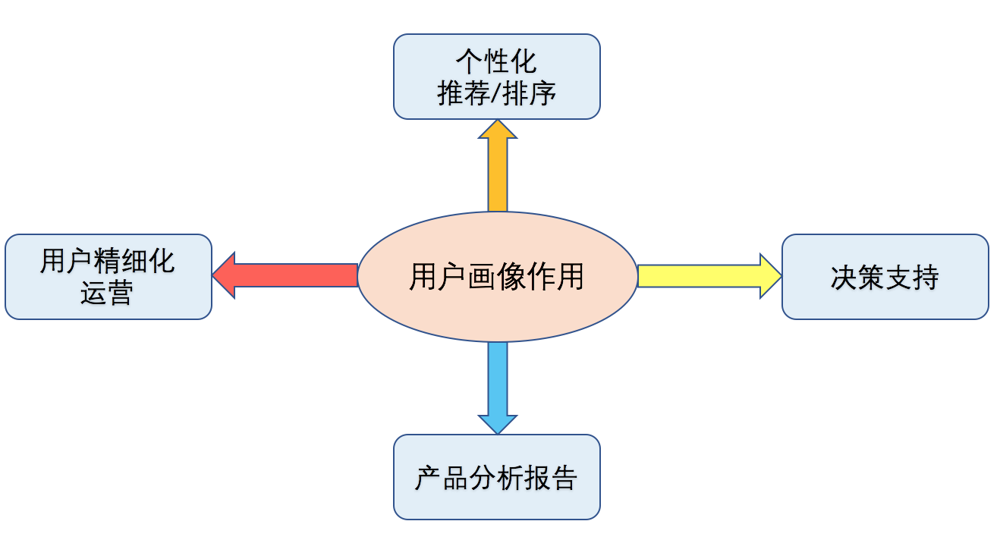

# 用户画像是什么

用户画像是根据用户的社会属性及各类行为，抽象出一个标签化的用户模型。其核心工作主要包括两点：
   
**构建标签集:** 根据实际业务需求、平台、数据等，确定用户画像的标签集合。如针对不同需求，可能需要用户兴趣画像、年龄性别画像、人群画像、地址画像、生命周期画像等，每类用户画像都可以确定对应的标签集合。

**为用户贴上标签:** 根据用户的社会属性和各类行为数据，利用机器学习模型或者相关规则，为用户贴上对应的标签。
 

# 用户画像的作用

通过构建用户画像，可以帮助我们更好地了解用户和产品，在个性化推荐和排序、用户精细化运营、产品分析，及辅助决策等方面，发挥很大的作用。如图1所示。

图1 &ensp;用户画像的作用

+ **个性化推荐和排序**
**个性化推荐：**通过构建用户兴趣画像，可直接用于基于内容的推荐算法中，在一定程度上解决推荐过程中的冷启动问题；另外，用户画像可用于候选召回模块，在推荐排序阶段可作为有效的特征进行使用。
**搜索排序：**通过加入用户画像特征，能够产生更加个性化的搜索效果，提升用户体验。

+ **用户精细化运营**
通过用户画像，使得在用户运营时，只选择相关的用户进行运营，提升运营的效率，节省运营成本。如通过用户流失预测模型，得到预流失用户，可以只针对这部分用户采取挽回措施；在进行相关运营推送活动中，只针对目标用户进行推送,可以减少不必要的资源浪费和用户干扰。

+ **产品分析报告**
通过构建用户画像，有助于对产品分析，如产品人群分布，产品趋势预测等，产出相关的产品分析报告。

+ **决策支持**
通过构建用户画像，能够更加了解平台用户相关信息，有助于产品决策。

+ **其它**
另外，用户画像还可用于定向广告投放，垂直行业分析等。

# 用户画像建模实践

